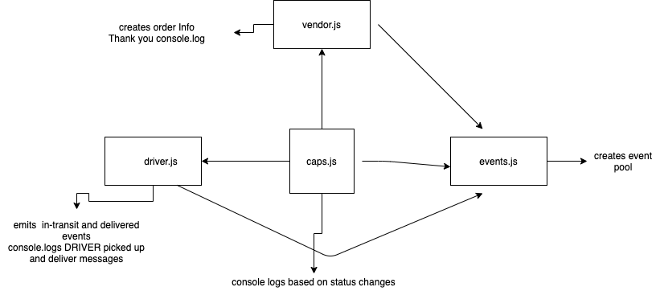

# LAB - Class 11

## Project: CAPS

### Author: Sara Strasner

### Links and Resources

- [ci/cd](https://github.com/sarastrasner/caps/actions)
- [latest pull reques](https://github.com/sarastrasner/caps/pull/3) 

### Setup

#### `.env` requirements (where applicable)

- STORE=Unicorn Rentals

#### How to initialize/run your application (where applicable)

- e.g. `npm caps.js`

#### How to use your library (where applicable)

#### Tests

- Tests runnning via Jest.
- Any tests of note?
- Describe any tests that you did not complete, skipped, etc

#### UML
